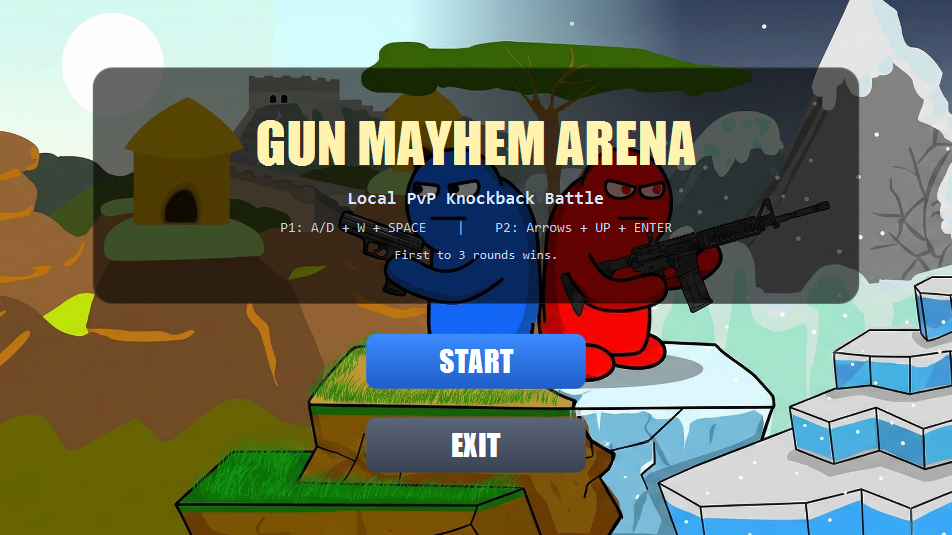
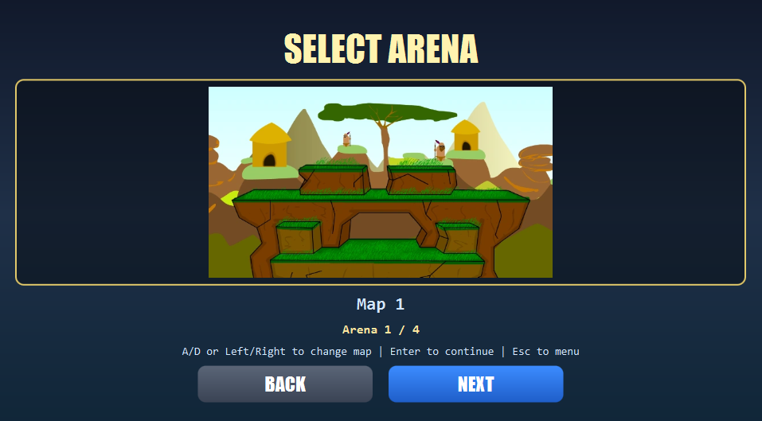
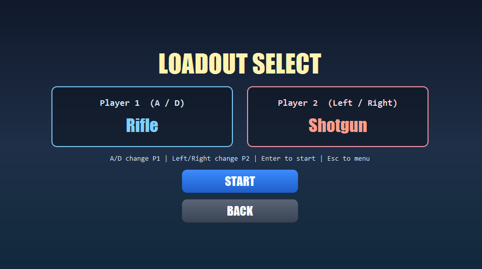
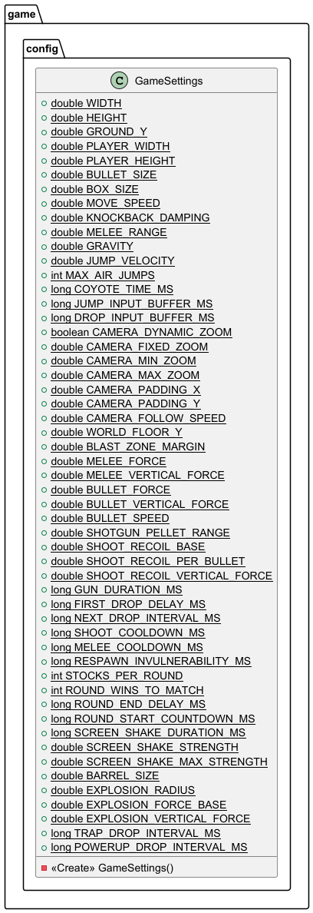
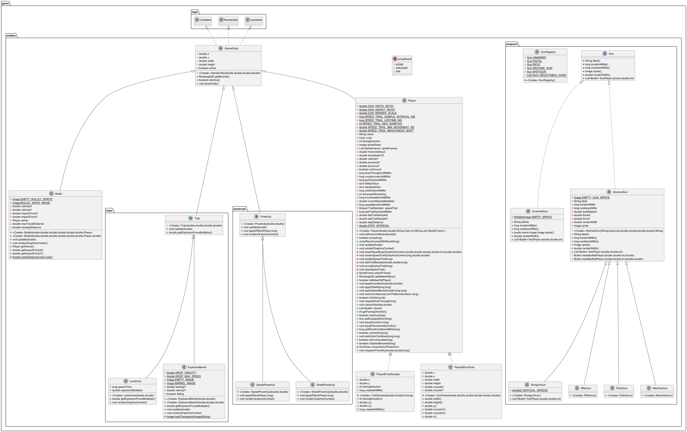
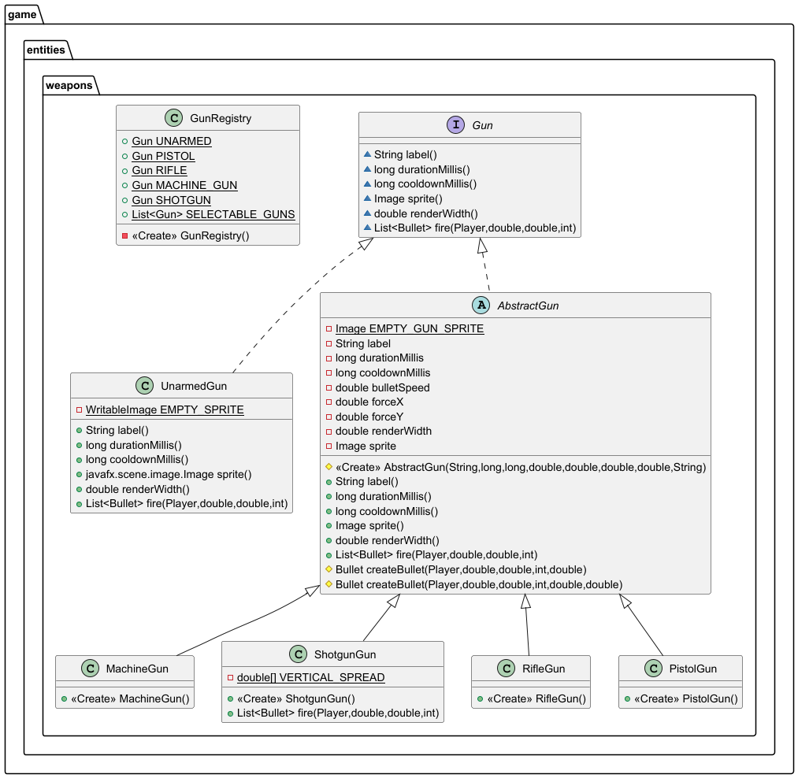
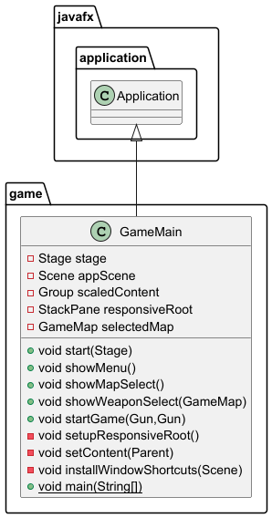
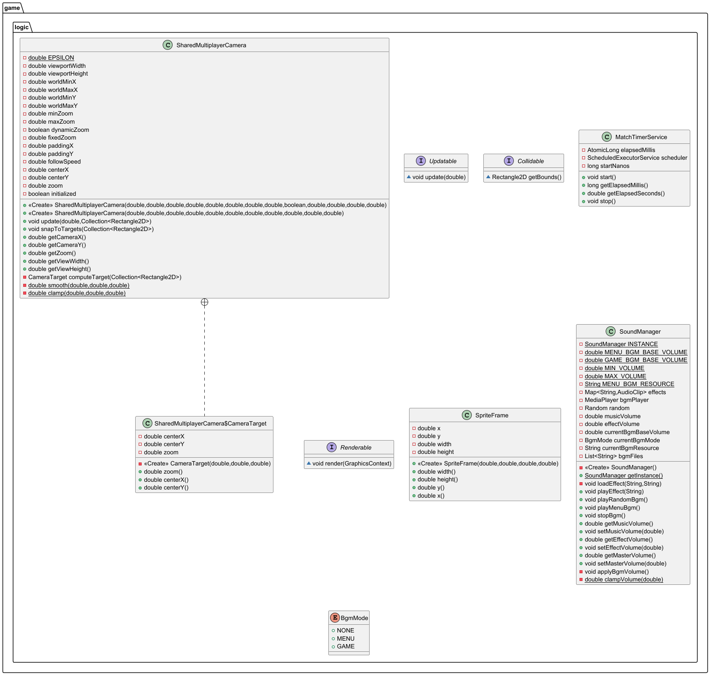
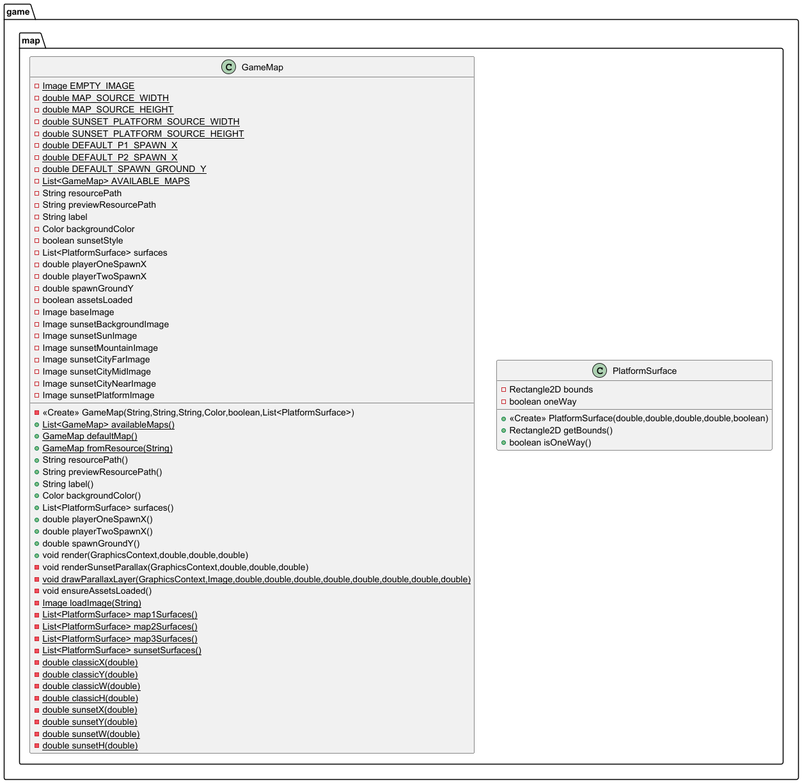
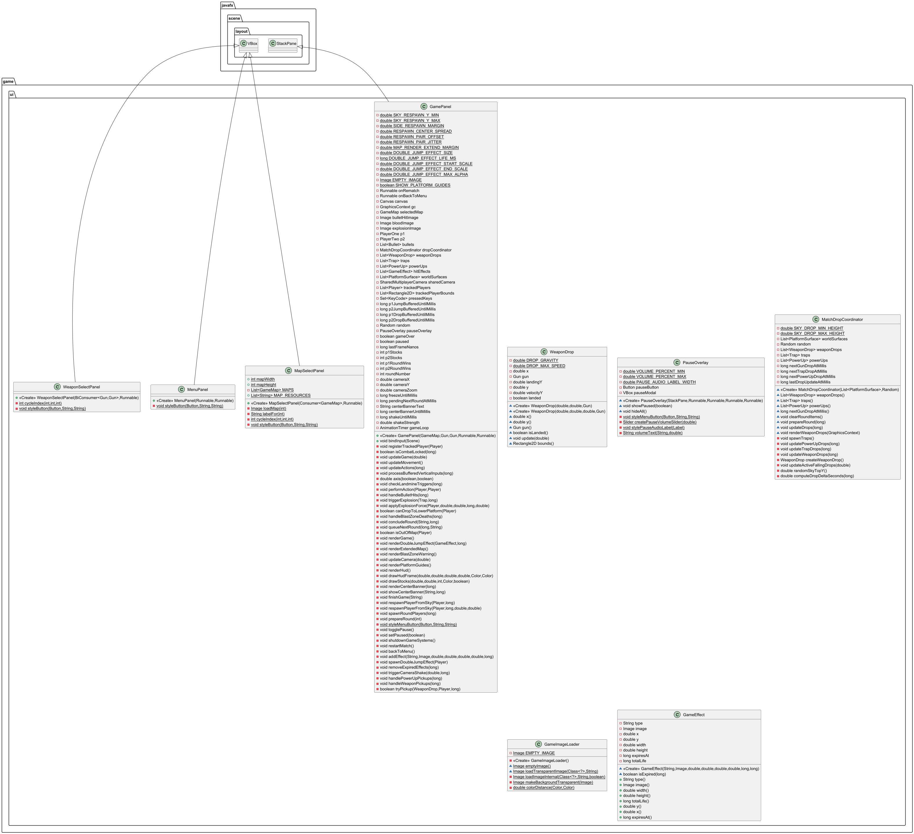

# รายงานโครงงาน Gun Mayhem Arena

## 1) ข้อมูลโครงงาน

- ชื่อโครงงาน: Gun Mayhem Arena
- ภาษา: Java (JavaFX)
- ระบบ Build: Gradle

## 2) วิธีใช้งานโปรแกรม

### 2.1 เตรียมสภาพแวดล้อม

- ติดตั้ง JDK (แนะนำเวอร์ชัน 21 หรือสูงกว่า)
- ใช้งานในโฟลเดอร์โปรเจกต์นี้ (`Project`)

### 2.2 คำสั่งรันโปรแกรม

```powershell
.\gradlew.bat run
```

### 2.3 คำสั่งทดสอบ

```powershell
.\gradlew.bat test
```

### 2.4 คำอธิบายเมนูและฟังก์ชันหลัก

1. **หน้าเมนูหลัก (Main Menu)**
    - ปุ่ม **START** กดเพื่อเข้าสู่ขั้นตอนการเลือกด่าน
    - ปุ่ม **EXIT** กดเพื่อปิดและออกจากโปรแกรม
      

2. **หน้าเลือกด่าน (Map Select)**
    - ผู้เล่นสามารถเลือกด่านที่ต้องการต่อสู้ได้ โดยแต่ละด่านมีรูปแบบและตำแหน่งของแพลตฟอร์มแตกต่างกัน
    - **วิธีควบคุม**
        - กดปุ่ม `A / D` หรือ ลูกศรซ้าย / ขวา เพื่อเลื่อนดูด่าน
        - กดปุ่ม `Enter` หรือ ปุ่ม **NEXT** เพื่อยืนยันการเลือก
        - กด `ESC` หรือ ปุ่ม **BACK** เพื่อย้อนกลับไปเมนูหลัก
          

3. **หน้าเลือกอาวุธเริ่มต้น (Weapon Select)**
    - ผู้เล่นทั้งสองสามารถเลือกอาวุธปืนเริ่มต้น (Starting Loadout) ได้ 4 ชนิด ได้แก่ **Pistol**, **Rifle**, **Machine Gun**, **Shotgun**
    - **วิธีควบคุม**
        - Player 1 กดปุ่ม `A / D` เพื่อเปลี่ยนปืน
        - Player 2 กดปุ่ม ลูกศรซ้าย / ขวา เพื่อเปลี่ยนปืน
        - กดปุ่ม `Enter` หรือ ปุ่ม **START** เพื่อเริ่มการต่อสู้
        - กด `ESC` หรือ ปุ่ม **BACK** เพื่อย้อนกลับไปหน้าเลือกด่าน

4. **หน้าจอการเล่นหลัก (Game Panel)**
    - เมื่อเข้าสู่เกม ผู้เล่นจะต้องบังคับตัวละครเพื่อต่อสู้กัน
    - **ปุ่มควบคุม Player 1**
        - `A / D` เดินซ้าย / ขวา
        - `W` กระโดด (สามารถกดกระโดดซ้อนกลางอากาศได้สูงสุด 2 ครั้ง)
        - `S` ทิ้งตัวลงผ่านแพลตฟอร์ม (Drop through)
        - `SPACE` โจมตี (ยิงปืน หรือ ตีระยะประชิด)
    - **ปุ่มควบคุม Player 2**
        - ลูกศรซ้าย / ขวา เดินซ้าย / ขวา
        - ลูกศรขึ้น กระโดด (Double Jump ได้เช่นกัน)
        - ลูกศรลง ทิ้งตัวลงผ่านแพลตฟอร์ม
        - `ENTER` โจมตี (ยิงปืน หรือ ตีระยะประชิด)
    - **ระบบไอเทมภายในด่าน**
        - **Weapon (อาวุธ)** ดรอปอาวุธแบบสุ่ม ใช้งานได้ 15 วินาทีก่อนกลับไปปืนเริ่มต้น
        - **Traps (กับดัก)** ถังระเบิด (TNT) และแผ่นกับระเบิด (Landmine) ถ้ายิงหรือเหยียบจะเกิดการระเบิดผลักผู้เล่น
        - **Power-ups (ไอเทมเสริมพลัง)** กล่องโล่สีฟ้า (อมตะ 5 วินาที) และกล่องความเร็วสีเหลือง (วิ่งเร็วขึ้น 5 วินาที)
    - **การหยุดเกมชั่วคราว (Pause)**
        - กด `ESC` หรือคลิกปุ่ม Pause ที่มุมขวาบน
        - ตัวเลือกในหน้าหยุดเกม
            - เล่นต่อ (Resume)
            - เริ่มแมตช์ใหม่ (Restart)
            - กลับไปหน้าเมนูหลัก (Main Menu)
            - ปรับเสียงเพลงและเอฟเฟ็กต์ในเกม
              

### 2.5 หลักการเล่นเกม

#### 2.5.1 เกมเกี่ยวกับอะไร

- เกมเป็นแนว Local Multiplayer 1v1 บนแพลตฟอร์ม
- เป้าหมายคือผลัก/โจมตีอีกฝ่ายให้ตกออกนอกฉาก (เน้นแรงกระแทกและการคุมตำแหน่ง)
- ระหว่างเกมจะมีอาวุธ กล่องดรอป กับดัก และพาวเวอร์อัปแบบสุ่มให้แย่งกันเก็บ

#### 2.5.2 ชนะ/แพ้อย่างไร

- แต่ละรอบผู้เล่นเริ่มด้วย `3 Stocks` ต่อคน
- เมื่อผู้เล่นตกลงต่ำกว่าพื้นที่เล่น (Blast Zone) จะเสีย 1 stock และเกิดการ respawn
- ถ้า stock หมดก่อน จะเสียรอบนั้น
- ผู้ที่ชนะให้ครบ `3 รอบ` ก่อน จะชนะทั้งแมตช์
- กรณี `Double KO` ทั้งสองฝั่งจะเสีย stock พร้อมกัน และระบบตัดสินตาม stock ที่เหลือ

#### 2.5.3 ผู้เล่นสามารถทำอะไรได้บ้าง

- เคลื่อนที่ซ้าย/ขวา, กระโดด, และกระโดดกลางอากาศได้เพิ่มอีก 1 ครั้ง
- กดลงเพื่อลงผ่านแพลตฟอร์มแบบ one-way
- โจมตีได้ 2 แบบ:
    - มีปืน: ยิงกระสุน (แต่ละปืนมี cooldown และแรง recoil ต่างกัน)
    - ไม่มีปืน: โจมตีระยะประชิด (melee)
- เก็บกล่องอาวุธเพื่อเปลี่ยนอาวุธชั่วคราว (เช่น Pistol/Rifle/Machine/Shotgun)
- ใช้สภาพแวดล้อมต่อสู้:
    - กับดัก: ถังระเบิดและทุ่นระเบิด
    - ยิง/ตี/เหยียบเพื่อกระตุ้นการระเบิด และผลักคู่ต่อสู้ออกฉาก
- เก็บพาวเวอร์อัป:
    - Shield: อมตะชั่วคราว
    - Speed: เพิ่มความเร็วเคลื่อนที่ชั่วคราว

## 3) เอกสารอธิบายโค้ด (JavaDoc)

> ตามเงื่อนไขรายงาน: วางลิงก์ JavaDoc หลังวิธีใช้งานโปรแกรม

### 3.1 คำสั่งสร้าง JavaDoc

```powershell
.\gradlew.bat javadoc
```

### 3.2 ลิงก์ JavaDoc

- [JavaDoc - หน้าแรก](build/docs/javadoc/index.html)
- [JavaDoc - สรุปแพ็กเกจ](build/docs/javadoc/overview-summary.html)

### 3.3 ไฟล์โปรแกรมแบบ `.jar`

### 3.3.1 คำสั่งสร้างไฟล์ `.jar`

```powershell
.\gradlew.bat jar
```

### 3.3.2 ลิงก์ไฟล์ `.jar`

- [Project-1.0-SNAPSHOT.jar](build/libs/Project-1.0-SNAPSHOT.jar)

### 3.4 คำสั่งเตรียมไฟล์ก่อน push

```powershell
.\gradlew.bat javadoc jar
git add build/docs/javadoc build/libs/Project-1.0-SNAPSHOT.jar
```

## 4) UML Diagram (แยกรูปครบทุกส่วน)

### 4.1 Config



### 4.2 Entity



### 4.3 Entity-Weapon



### 4.4 GameMain



### 4.5 Logic



### 4.6 Map



### 4.7 UI



> ไฟล์ต้นฉบับ UML (`.puml`) อยู่ที่ root ของโปรเจกต์  
> (`Config.puml`, `Entity.puml`, `Entity-Weapon.puml`, `GameMain.puml`, `Logic.puml`, `Map.puml`, `UI.puml`)

## 5) สรุปโครงสร้างโค้ดโดยย่อ

- `src/main/java/game/GameMain.java`: จุดเริ่มต้นโปรแกรมและการเปลี่ยนหน้าจอ
- `src/main/java/game/config/`: ค่าคงที่เกม (`GameSettings`)
- `src/main/java/game/entities/`: ผู้เล่น กระสุน อาวุธ กับดัก พาวเวอร์อัป
- `src/main/java/game/logic/`: กล้อง เสียง ตัวจับเวลา และ interface หลัก
- `src/main/java/game/map/`: ข้อมูลแมพ พื้นผิว และการเรนเดอร์แมพ
- `src/main/java/game/ui/`: เมนู หน้าเลือกแมพ/อาวุธ หน้าจอเล่น และ pause overlay

## 6) หมายเหตุ

- หากเปิดลิงก์ JavaDoc ไม่ได้จากตัว Markdown ให้เปิดไฟล์นี้โดยตรง:
    - `build/docs/javadoc/index.html`
- ไฟล์รายงานนี้อ้างอิงลิงก์แบบ relative path ดังนั้นต้อง push โฟลเดอร์ `build/docs/javadoc` และไฟล์ `build/libs/Project-1.0-SNAPSHOT.jar` ขึ้น repository ด้วย
- ควรรัน `.\gradlew.bat javadoc` ใหม่ทุกครั้งหลังแก้โค้ด เพื่อให้เอกสารอัปเดตล่าสุด
